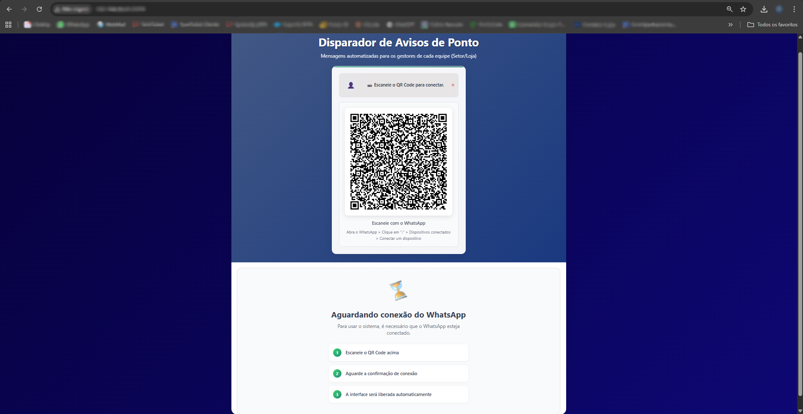
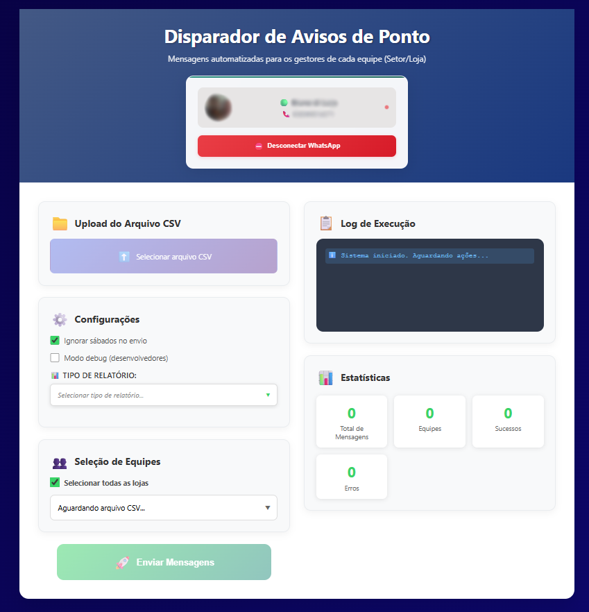
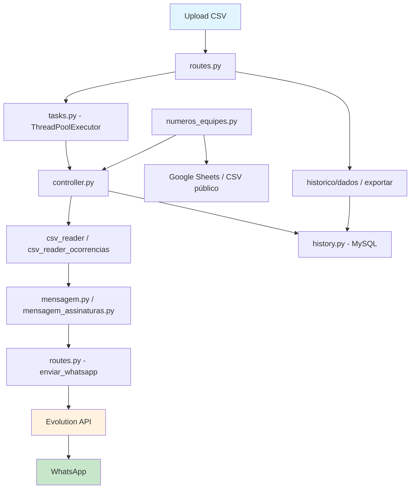

# TopFama - Disparador de Mensagens PontoMais

> Automação inteligente de avisos de ponto via WhatsApp para gestores

## Índice

- [Descrição](#descrição)
- [Status do Projeto](#status-do-projeto)
- [Demonstração](#demonstração)
- [Tecnologias](#tecnologias)
- [Arquitetura](#arquitetura)
- [Instalação](#instalação)
- [Integração com Google Sheets](#integração-com-google-sheets)
- [Números de WhatsApp por Equipe](#números-de-whatsapp-por-equipe)
- [Uso](#uso)

## Descrição

O **Disparador de Aviso de Ponto** é uma solução web que automatiza o envio de mensagens WhatsApp para gestores sobre irregularidades no sistema de ponto eletrônico. A aplicação processa relatórios CSV gerados pelo PontoMais, identifica faltas, atrasos e outras ocorrências, e envia notificações personalizadas para cada equipe/loja.

### Principais funcionalidades:
- 📊 Processamento automatizado de relatórios CSV (Auditoria, Ocorrências e Assinaturas)
- 💬 Integração com WhatsApp via Evolution API
- 🎯 Envio direcionado por equipe/loja
- ⚙️ Interface intuitiva com configurações flexíveis
- 📋 Log detalhado de execução
- 📈 Histórico de envios com exportação para Excel
- 🔄 Processamento assíncrono com polling de status
- 🔒 Proteção contra reenvio duplicado de relatórios

### Problema que resolve:
Elimina o trabalho manual de análise de relatórios de ponto e notificação individual de gestores, reduzindo erros humanos e garantindo que todas as irregularidades sejam comunicadas de forma rápida e organizada.

## Status do Projeto

✅ **Estável e em Produção**

O sistema está operacional e sendo usado ativamente pela TopFama para gestão de ponto de múltiplas lojas. Novas funcionalidades são adicionadas conforme a necessidade.

## Demonstração


*Tela de conexão com WhatsApp via QR Code*


*Interface principal com upload de CSV e configurações*

## Tecnologias

### Backend
- **Python 3.11+** - Linguagem principal (imagem Docker usa `python:3.11-slim`)
- **Flask 3.x** - Framework web
- **Gunicorn** - Servidor WSGI para produção (`gthread` worker, porta `8000`)
- **Pandas** - Processamento de dados CSV
- **Requests** - Cliente HTTP para Evolution API
- **Python-dotenv** - Gerenciamento de variáveis de ambiente
- **openpyxl** - Exportação de histórico para Excel
- **gspread / google-auth** - Integração opcional com Google Sheets
- **mysql-connector-python** - Persistência em banco MySQL (histórico de envios)

### Frontend
- **HTML5/CSS3** - Interface responsiva
- **JavaScript ES6+** - Lógica client-side modular
- **CSS Grid/Flexbox** - Layout responsivo
- **Drag & Drop API** - Upload intuitivo de arquivos

> **Node.js não é necessário.** O frontend é servido diretamente pelo Flask como arquivos estáticos (`/static`) e templates Jinja2 (`/templates`).

### Integração
- **Evolution API** - Gateway WhatsApp
- **SMTP** - Utilitário para envio de log de erro por e-mail (`app/services/email_sender.py`, não acionado automaticamente pelo fluxo atual)
- **Google Sheets API** - Gravação de dados processados em planilha (opcional)
- **MySQL** - Histórico de envios por equipe/relatório

### Infraestrutura
- **Docker** - Containerização
- **Gunicorn** - Servidor WSGI para produção
- **Nginx** - Proxy reverso e servir arquivos estáticos (recomendado em produção)

## Arquitetura



<details>
<summary>Detalhes da Arquitetura</summary>

### Fluxo Principal:
1. **Upload**: Interface recebe arquivo CSV via drag-and-drop ou seleção
2. **Enfileiramento**: A rota `/enviar` salva o arquivo e agenda a tarefa com `ThreadPoolExecutor`
3. **Verificação de sessão**: Antes de processar, a tarefa confirma que a instância do WhatsApp está com status `open` na Evolution API; caso contrário, a tarefa termina em erro
4. **Polling**: O frontend consulta `/status/<task_id>` até o processamento terminar
5. **Mapeamento**: Equipes são categorizadas (CD, Lojas, Departamentos)
6. **Mensagens**: Templates personalizados por tipo de ocorrência
7. **Envio**: Integração com Evolution API para WhatsApp
8. **Histórico**: Registros gravados no MySQL com status de sucesso/erro (tabelas `envios`, `relatorios` e `relatorio_pendencias`)

> **Reconexão automática**: se a instância permanecer no estado `connecting` por mais de 60 segundos, `verificar_sessao()` (em `app/routes.py`) força um logout na Evolution API para que o status volte a `close` e a interface possa reconectar via QR Code.

### Componentes Principais:
- `app/routes.py` — Blueprint Flask com todos os endpoints da API
- `app/tasks.py` — Fila de tarefas assíncronas com `ThreadPoolExecutor`
- `app/controller.py` — Orquestração do fluxo de processamento e envio
- `app/processamento/csv_reader.py` — Parser para relatórios de Auditoria
- `app/processamento/csv_reader_ocorrencias.py` — Parser para relatórios de Ocorrências
- `app/processamento/csv_reader_assinaturas.py` — Parser para relatórios de Assinaturas
- `app/processamento/ocorrencias_processor.py` — Geração de mensagens para relatórios de Ocorrências (chamado por `mensagem.py`) e filtro `filtrar_pendencia_gestor` (checkbox "Enviar apenas ajustes pendentes de aprovação do gestor")
- `app/history.py` também expõe `buscar_ocorrencias_enviadas`, usada para detectar ocorrências (pessoa+data+motivo) já enviadas em relatórios anteriores e evitar duplicidade
- `app/whatsapp/mensagem.py` — Templates e geração de mensagens de Auditoria; despacha para `ocorrencias_processor.py` quando o tipo é Ocorrências
- `app/whatsapp/mensagem_assinaturas.py` — Templates para relatórios de Assinaturas
- `app/whatsapp/numeros_equipes.py` — Resolução de número de WhatsApp por equipe, lendo a planilha configurada em `PLANILHA_EQUIPES_*`
- `app/history.py` — Leitura e gravação do histórico de envios (MySQL)
- `app/history_export.py` — Exportação do histórico para planilha Excel
- `app/services/google_sheets.py` — Integração com Google Sheets
- `app/services/email_sender.py` — Utilitário para notificar erro crítico por e-mail com o log anexado; não é chamado automaticamente pelo fluxo atual (disponível para uso manual/futuro)
- `app/config/settings.py` — Leitura centralizada das variáveis de ambiente
</details>

## Instalação

### Pré-requisitos

- Python 3.11 ou superior
- Evolution API configurada e rodando
- MySQL acessível (para histórico de envios)
- Conta Google com Sheets API habilitada (opcional)

### Instalação Local

1. **Clone o repositório:**
```bash
git clone https://github.com/DiLucaYVL/disparador_wpp_pontomais.git
cd disparador_wpp_pontomais
```

2. **Crie um ambiente virtual:**
```bash
python -m venv .venv
source .venv/bin/activate  # Linux/Mac
# ou
.\.venv\Scripts\activate   # Windows
```

3. **Instale as dependências:**
```bash
pip install -r requirements.txt
```

4. **Configure as variáveis de ambiente:**
```bash
cp .env.example .env
# Edite o arquivo .env com suas configurações
```

Exemplo de `.env`:
```env
# Evolution API (gateway WhatsApp)
EVOLUTION_URL=http://localhost:8080
EVOLUTION_INSTANCE=seu-instance
EVOLUTION_TOKEN=seu-token

# Planilha de números de equipes (ver seção "Números de WhatsApp por Equipe")
PLANILHA_EQUIPES_URL=
PLANILHA_EQUIPES_SHEET_ID=
PLANILHA_EQUIPES_WORKSHEET=
PLANILHA_EQUIPES_GID=

# Banco de dados MySQL (histórico de envios)
DB_HOST=192.168.99.50
DB_PORT=3306
DB_NAME=enviodp
DB_USER=seu-usuario
DB_PASSWORD=sua-senha

# Google Sheets (opcional — grava o DataFrame processado em planilha)
GOOGLE_SHEETS_ENABLED=false
GOOGLE_SHEETS_SPREADSHEET_ID=
GOOGLE_SHEETS_WORKSHEET=Dados
GOOGLE_SHEETS_CREDENTIALS_FILE=
GOOGLE_SHEETS_CREDENTIALS_JSON=

# E-mail (opcional — utilitário para notificar erro crítico com log anexado)
EMAIL_USER=
EMAIL_PASS=
EMAIL_TO=
EMAIL_HOST=
EMAIL_PORT=
```

> Consulte [.env.example](.env.example) para a lista completa e comentada de variáveis.

5. **Execute localmente:**
```bash
python main.py
# Aplicação disponível em http://localhost:8000
```

### Instalação com Docker

1. **Build da imagem**
```bash
docker build -t topfama-disparador .
```

2. **Subir o container expondo em 192.168.99.50:8000**
```bash
docker run -d \
  --name disparador \
  --env-file .env \
  -p 192.168.99.50:8000:8000 \
  -v disparador_uploads:/app/uploads \
  -v disparador_logs:/app/log \
  -v disparador_task_status:/app/task_status \
  -v ./secrets:/app/secrets:ro \
  topfama-disparador
```

3. **Alternativa com Docker Compose**
```bash
docker compose up -d
```

> Ajuste o `.env` antes de subir a imagem. Os volumes mantêm uploads, logs e histórico fora do container.

### Configuração de Produção

<details>
<summary>Deploy com Nginx e Gunicorn</summary>

O Gunicorn é iniciado automaticamente pelo Docker com as configurações do `gunicorn.conf.py` (porta `8000`, worker `gthread`, timeout de 10 minutos).

Para deploy manual com Nginx como proxy reverso:

```bash
# Executar com configuração existente
gunicorn -c gunicorn.conf.py main:app

# Configurar Nginx (exemplo)
server {
    listen 80;
    server_name seu-dominio.com;

    location / {
        proxy_pass http://localhost:8000;
        proxy_set_header Host $host;
        proxy_set_header X-Real-IP $remote_addr;
    }

    location /static {
        alias /caminho/para/static;
        expires 1d;
    }
}
```
</details>

#### URLs da aplicação

- **Interface web**: `http://<host>:8000/` — tela principal de envio de relatórios
- **Histórico**: `http://<host>:8000/historico` — página de histórico de envios
- **API interna**: o frontend usa automaticamente `window.location.origin` para
  conversar com o backend Flask. Dessa forma, a mesma URL acessada no
  navegador é reutilizada nas requisições.
- **EVOLUTION_URL**: variável de ambiente que aponta para a Evolution API
  externa, responsável pelo envio das mensagens de WhatsApp. Defina esse valor
  no arquivo `.env`.

## Integração com Google Sheets

### O que ela faz
- Após o upload do CSV, o DataFrame processado é enviado para a planilha indicada.
- Se a aba estiver vazia, o cabeçalho é criado automaticamente; novas linhas são sempre anexadas abaixo das existentes.
- Duas colunas extras são gravadas: `TipoRelatorio` e `NomeRelatorio` (quando informado), para rastrear a origem dos dados.

### Como configurar
1. Acesse o **Google Cloud Console** e habilite a **Google Sheets API**.
2. Crie uma **Service Account**, gere a chave JSON e baixe o arquivo.
3. Abra a planilha de destino e compartilhe com o e-mail da Service Account com permissão de **Editor**.
4. Preencha o `.env` com as variáveis abaixo (arquivos `.env` nunca devem ser versionados):
   - `GOOGLE_SHEETS_ENABLED=true`
   - `GOOGLE_SHEETS_SPREADSHEET_ID=<ID da planilha>` (o ID fica entre `/d/` e `/edit` na URL).
   - `GOOGLE_SHEETS_WORKSHEET=Dados` (ou o nome da aba que preferir; se não existir, a aba será criada).
   - Defina **uma** das opções de credencial:
     - `GOOGLE_SHEETS_CREDENTIALS_FILE=/caminho/para/sua-chave.json` **ou**
     - `GOOGLE_SHEETS_CREDENTIALS_JSON={"type": "...", ...}` (conteúdo completo do JSON em uma única linha).
5. Reinstale dependências para incluir o cliente de Sheets:
   ```bash
   pip install -r requirements.txt
   ```

Pronto: ao subir um novo CSV pela interface, as linhas processadas serão copiadas para o Google Sheets escolhido.

## Números de WhatsApp por Equipe

O número de WhatsApp de cada equipe/loja (para onde as mensagens são enviadas) é resolvido em tempo real por `app/whatsapp/numeros_equipes.py`, a partir de uma planilha com duas colunas (`Equipe`, `Numero`). A fonte é escolhida na seguinte ordem:

1. **CSV público** — se `PLANILHA_EQUIPES_URL` estiver definida, o sistema tenta ler a planilha diretamente por essa URL (ex.: link de exportação CSV do Google Sheets). É o caminho mais rápido e não exige credenciais.
2. **Google Sheets API (fallback)** — se a leitura via CSV falhar (ou a URL não estiver definida), o sistema usa a mesma *service account* configurada para `GOOGLE_SHEETS_CREDENTIALS_FILE`/`GOOGLE_SHEETS_CREDENTIALS_JSON` e abre a planilha pelo `PLANILHA_EQUIPES_SHEET_ID`. Nesse caso, use `PLANILHA_EQUIPES_WORKSHEET` para indicar a aba pelo nome ou `PLANILHA_EQUIPES_GID` para indicar pelo `gid` da aba (a URL também pode conter o `gid`, extraído automaticamente).

Números brasileiros são normalizados automaticamente (remoção de `+55`/`0055`, remoção do 9º dígito quando aplicável) para o formato aceito pela Evolution API.

## Uso

### 1. Conectar WhatsApp

Acesse a interface web e escaneie o QR Code com seu WhatsApp. O sistema exibe o status de conexão em tempo real consultando a Evolution API.

### 2. Upload de Relatório

Faça upload do arquivo CSV gerado pelo PontoMais:

```bash
# Tipos de relatório suportados:
- Auditoria    (faltas, horas extras, interjornada, etc.)
- Ocorrências  (ajustes pendentes, etc.)
- Assinaturas  (pendências de assinatura de ponto)
```

### 3. Configurações

```javascript
// Opções disponíveis:
{
  "ignorarSabados": true,        // Ignora ocorrências de sábado
  "tipoRelatorio": "Auditoria",  // "Auditoria", "Ocorrências" ou "Assinaturas"
  "equipesSelecionadas": ["CD10", "LOJA 75", "RH"],  // Filtros opcionais
  "debugMode": false,            // Retorna o DataFrame parsed no resultado
  "forcarReenvio": false,        // Força reenvio de relatório já concluído
  "apenasGestor": false,         // Só relatório "Ocorrências": envia/registra apenas
                                  // linhas com Ação pendente = "Gestor aprovar solicitação
                                  // de ajuste" (ignora pendências do colaborador)
  "incluirDuplicadas": false     // Só relatório "Ocorrências" com apenasGestor ativo: se
                                  // false, ocorrências (mesma pessoa+data+motivo) já
                                  // enviadas com sucesso em qualquer upload anterior são
                                  // puladas; o frontend pergunta ao usuário antes de enviar
}
```

> O filtro "Enviar apenas ajustes pendentes de aprovação do gestor" e a checagem de duplicidade se aplicam somente ao relatório **Ocorrências** (que tem a coluna `Ação pendente`) — o relatório Auditoria não possui esse dado e não é afetado. Ao selecionar o arquivo CSV, a interface avisa se o checkbox está marcado ou não e pede confirmação antes de processar.

### 4. Processamento Assíncrono

O envio é processado em segundo plano. A interface consulta o status periodicamente:

```
POST /enviar        → retorna task_id (HTTP 202)
GET  /status/{id}   → { status: "queued" | "running" | "done" | "error", log, stats }
```

### 5. Exemplo de Mensagem

```
*LOJA 75*

*NO DIA 15/01/2024:*
• João Silva faltou. Por favor justificar.
• Maria Santos fez 3 horas e 15 minutos extras. Por favor ajustar.

*NO DIA 16/01/2024:*
• Carlos Oliveira ficou devendo 02:30 horas. Por favor justificar.
```

### API Endpoints

<details>
<summary>Endpoints Disponíveis</summary>

```bash
# Configurações da instância Evolution
GET /config
→ { EVOLUTION_URL, EVOLUTION_INSTANCE }

# Extrair equipes disponíveis no CSV
POST /equipes
Content-Type: multipart/form-data
{ csvFile, ignorarSabados, tipoRelatorio, apenasGestor }
→ { success, equipes: string[], duplicidade?: { novas, duplicadas } }
  # "duplicidade" só é retornado quando tipoRelatorio = "Ocorrências"

# Enviar relatório (agendamento assíncrono)
POST /enviar
Content-Type: multipart/form-data
{ csvFile, ignorarSabados, tipoRelatorio, equipesSelecionadas, debugMode, forcarReenvio, apenasGestor, incluirDuplicadas }
→ HTTP 202 { success, task_id, message }
→ HTTP 409 { code: "relatorio_concluido" | "relatorio_sem_pendencias" }

# Consultar status da tarefa
GET /status/<task_id>
→ { status: "queued"|"running"|"done"|"error", log, stats, nome_arquivo_log }

# Consultar status de um relatório pelo nome
GET /relatorios/status?nome=<nome_relatorio>
→ { status: "novo"|"sucesso_total"|"parcial", relatorio }

# Status do WhatsApp
GET /whatsapp/status
→ { success, connected, status, state }

# Obter QR Code para conexão
GET /whatsapp/qr
→ { instance, qr_code }

# Dados brutos da instância Evolution
GET /whatsapp/instance

# Desconectar WhatsApp
DELETE /whatsapp/logout

# Histórico de envios (com filtros opcionais)
GET /historico/dados?equipes=&tipos=&inicio=&fim=
→ { dados, resumo: { total, sucessos, erros }, equipes }

# Exportar histórico para Excel
GET /historico/exportar?equipes=&tipos=&inicio=&fim=
→ .xlsx (download)
```
</details>

### Customização de Mensagens

```python
# Edite app/whatsapp/mensagem.py para personalizar templates de Auditoria:

TEMPLATES = {
    "Mais de 6 dias de trabalho consecutivos": "*{nome}* está com mais de 6 dias consecutivos de trabalho. O colaborador deve *pegar folga* na semana seguinte.",
    "Falta": "*{nome}* _faltou_. Por favor *justificar*.",
    "Horas Faltantes": "*{nome}* ficou devendo *{horas}*. Por favor *justificar*.",
    "Interjornada insuficiente": "*{nome}* teve interjornada (período mínimo de descanso entre um expediente e outro) menor que 11h. _Tempo registrado_: *{horas}*.",
    "Intrajornada insuficiente": "*{nome}* teve pausa de almoço menor que 1h. _Tempo registrado_: *{horas}*.",
    "Horas extras": "*{nome}* fez *{horas_extras} extras*. Por favor *ajustar*."
    # Adicione novos templates conforme necessário
}

# {horas_extras} é formatado dinamicamente (singular/plural) por formatar_horas_extras():
#   "00:05" -> "5 minutos" | "01:00" -> "1 hora" | "02:15" -> "2 horas e 15 minutos"
# Toda ocorrência de "Horas extras" é enviada, sem corte mínimo (exceto 00:00, que é ignorado).

# Para mensagens de Ocorrências, edite app/processamento/ocorrencias_processor.py
# Para mensagens de Assinaturas, edite app/whatsapp/mensagem_assinaturas.py
```
